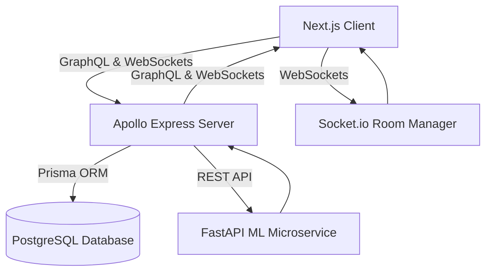

# 🌬️ ExamEve — AI-Powered Exam Preparation & Panic Optimizer

ExamEve is an industry-grade, microservice-driven platform designed to optimize exam preparation and manage study anxiety. Engineered for students facing high-stakes examinations, ExamEve uses machine learning heuristics to structure dynamic 48-to-96-hour study plans, calibrate self-reported mastery levels, and deliver real-time interactive anxiety management tools.

---

## 🏗️ Architecture Overview

ExamEve is designed as a distributed multi-service platform:



### Core Services
1. **Frontend (`/frontend`)**: Next.js 14 Web Portal styled with clean dark-mode custom CSS, animated glassmorphic dashboards, interactive Recharts visualizations (Area, Pie, Radar charts), and responsive navigation layout. Bridged with backend through NextAuth Google Sign-In and GraphQL JWT synchronization context.
2. **Backend Gateway (`/backend`)**: Modular Node.js Express server running Apollo Server (GraphQL). Features JWT signature verification context parser, structured database relations managed with Prisma, and interactive real-time Socket.io signaling.
3. **Machine Learning Service (`/ml-service`)**: Python Uvicorn engine running FastAPI. Handles confidence calibration models, behavioral panic signal analyzers, score prediction bands, and optimal topic prioritization pipelines.
4. **Redis Cache & Session Store**: Redis acts as a real-time message broker and pub-sub backend adapter for Socket.io room management, keeping WebSocket instances in sync across nodes, and caches GraphQL execution states.

---

## ⚡ Main Workflows & Operational Mechanics

### 1. The Onboarding & Syllabus Extraction Flow
* Users input exam metadata (subject, examination date, and academic board rules) and import target syllabus files.
* Topics are structured inside the database with customizable weightings and complexity indicators.
* Students assign initial subjective confidence scores (0-10) to initialize their mastery matrix.

### 2. ML-Calibrated Study Plan Generation
* The student triggers a study plan generation request (48, 72, or 96-hour duration options).
* The Backend queries the ML Microservice (`/api/prioritize-topics`) to rank syllabus components based on urgency:
  $$\text{Urgency} = \text{Topic Weightage} \times (1 - \text{Calibrated Confidence})$$
* A chronological timeline is built, scheduling dedicated study blocks, review windows, and breaks.
* If a student falls behind, the "Emergency Re-Plan" protocol deactivates older plans and recalculates schedules instantly.

### 3. Smart Study Session Tracking
* Users launch scheduled study blocks through the focus panel timer overlay (25, 45, or 60 min intervals).
* During focus sessions, Socket.io tracks real-time progress.
* Upon completion, students submit behavioral markers:
  - Energy level rating (1 to 5 Stars)
  - Post-session self-reported confidence revision
  - Log notes
* The session metrics are serialized to PostgreSQL, updating progress charts.

### 4. Interactive Panic Recovery Protocol
* High anxiety triggers (rapid study block switching, low confidence self-reports, or manual panic trigger clicks) activate the **Panic Recovery Mode**.
* The portal launches a 4-7-8 breathing visualizer modal, prompting the student to relax:
  - **Inhale**: 4 seconds (visual circle expansion)
  - **Hold**: 7 seconds (circle static scale)
  - **Exhale**: 8 seconds (visual circle contraction)
* When completed, a `'panic-recovered'` custom event fires, restoring readiness metrics on dashboards and returning focus directly to the single highest-priority pending task.

### 5. Performance Analytics & Radar Matrix
* Tracks study progress metrics dynamically using Recharts:
  - **Focus Progression**: Shows time logged per day over time.
  - **Mastery radar matrix**: A polar chart mapping calibrated mastery levels per topic category.
  - **Study Distribution**: Pie chart breaking down focus allocation percentages.

---

## 🚀 Quick Start Guide

Initialize the platform using Docker Compose (orchestrates postgres, client, backend, and ML services concurrently):

```bash
# Clone the repository
git clone https://github.com/AadityaUniyal/Examy_Prepp.git
cd Examy_Prepp/exameve

# Launch all containers
docker-compose up --build
```

### Google OAuth Configuration Setup
1. Go to the [Google Cloud Console](https://console.cloud.google.com/).
2. Create a new Project and navigate to **APIs & Services** > **Credentials**.
3. Create an **OAuth 2.0 Client ID** credential:
   - Application type: Web application
   - Authorized JavaScript origins: `http://localhost:3000`
   - Authorized redirect URIs: `http://localhost:3000/api/auth/callback/google`
4. Copy the generated **Client ID** and **Client Secret**.
5. Create `.env` files in `frontend`, `backend`, and `ml-service` based on `.env.example` templates, and populate `NEXT_PUBLIC_GOOGLE_CLIENT_ID` and `GOOGLE_CLIENT_SECRET` variables respectively.


### Manual Development Setup

If you prefer starting services individually for development:

#### 1. Database & Backend Setup
```bash
cd backend
npm install

# Configure your environment (.env)
cp .env.example .env

# Run database migrations and seed default user (mock-student-123)
npx prisma migrate dev
node src/prisma/seed.js

# Start backend dev server (Port 4000)
npm run dev
```

#### 2. ML Service Setup
```bash
cd ml-service

# Initialize Python virtual environment
python -m venv venv
source venv/bin/activate  # On Windows use: venv\Scripts\activate

# Install dependencies
pip install -r requirements.txt

# Start FastAPI server (Port 8000)
python -m uvicorn app.main:app --reload
```

#### 3. Frontend Portal Setup
```bash
cd frontend
npm install

# Configure environment (.env.local)
cp .env.example .env.local

# Run frontend portal (Port 3000)
npm run dev
```

---

## 🛠️ Technology Stack

* **Frontend**: Next.js 14, Apollo Client, Recharts, Tailwind CSS, Zustand, Lucide React, Radix UI.
* **Backend**: Node.js, Express, Apollo Server (GraphQL), Socket.io, Prisma ORM, JSON Web Tokens.
* **Database**: PostgreSQL (Relational master), Prisma migrations.
* **Machine Learning Microservice**: Python, FastAPI, Uvicorn, Axios.
